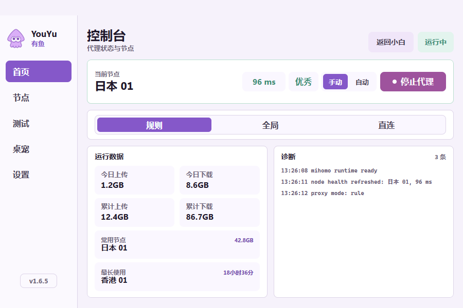
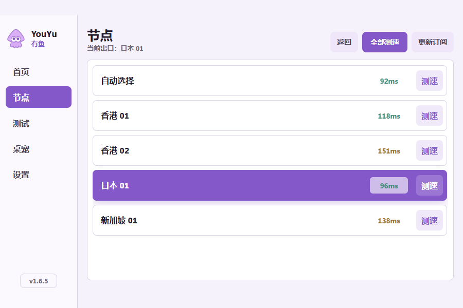
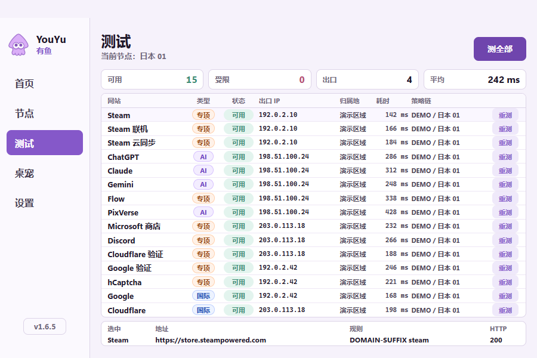
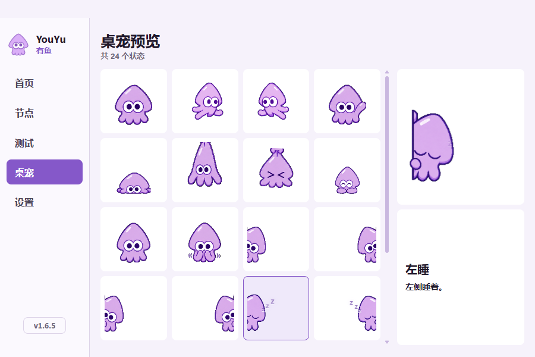
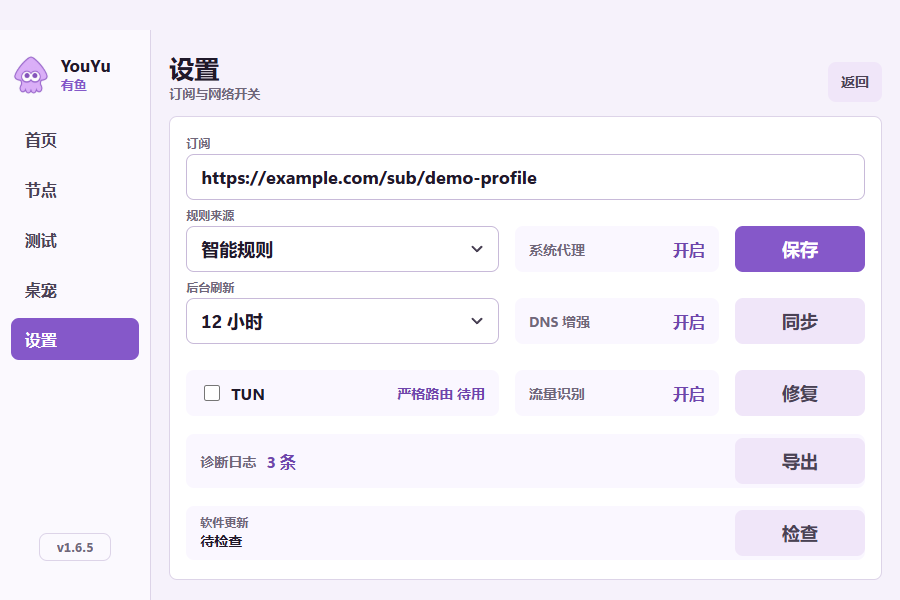

# YouYu：Windows Mihomo 桌面客户端

[](https://github.com/fishknowsss/YouYu/releases/latest)
[](https://github.com/fishknowsss/YouYu/actions/workflows/validate.yml)
[](https://github.com/fishknowsss/YouYu/actions/workflows/build-windows.yml)
[](https://github.com/fishknowsss/YouYu/releases/latest)
[](https://fishknowsss.github.io/YouYu/)

YouYu 是一款面向 Windows x64 的 Mihomo 桌面客户端，提供代理启停、节点选择与健康检查、连通性测试、流量统计、系统网络修复、自动更新和桌宠交互。

当前源码与最新公开发布版本均为 [`1.6.5`](https://github.com/fishknowsss/YouYu/releases/tag/v1.6.5)。公开安装包与更新文件见 [GitHub Releases](https://github.com/fishknowsss/YouYu/releases/latest)，版本演进见 [CHANGELOG](CHANGELOG.md)，本版完整说明见 [v1.6.5 迭代说明](docs/releases/v1.6.5.md)。

## 1.6.5 迭代重点

- Steam 前三项改用轻量串行探测和瞬时故障重试，加入按分流出站的定向 DoH、ARC 缓存与切节点后的 Mihomo DNS 缓存刷新，降低弱节点的偶发 DNS / TCP / TLS 失败。
- 节点全部测速期间可直接切换节点；测试页“测全部”运行后可切换为“停止”，真正取消当前 curl 并不再启动后续项目。
- 专业模式四页共用统一页头操作轨，首页“运行数据 / 诊断”共用面板标题结构，标题基线、顶右边界与正文间距保持一致。
- 点击“安装”后会先保留界面并显示“已开始自动安装，无需操作”，约 2 秒后再交接静默安装与自动重启；缓冲期内关闭窗口或托盘退出不会中断交接，失败时恢复可重试状态。

## 1.6.4 迭代重点

- 修复 Windows 计划任务省略默认 `RunLevel`、`Enabled` 字段时被误判为旧任务，进而尝试重写并显示“同步开机自启失败”的问题；符合当前应用、隐藏启动参数和普通交互用户边界的任务现在直接沿用。
- 专业模式左下角版本号改为真正的隐藏入口：无悬停或按压外观变化，连续点击 7 次才进入重新登记；版本号外侧左距与下距在不同侧栏宽度下保持一致。
- 设置页改为唯一父级控制的六行网格，六个 64px 轨道与五处 8px 间距连续排列；订阅、三行设置、诊断日志和软件更新不再分别由多组布局控制。

## 1.6.3 迭代重点

- 设置页订阅、规则、后台刷新、TUN、诊断日志和软件更新六行改为统一的 16px 垂直间距，保留各行原有高度、三列关系和操作列宽度。
- 测试页移除单独的页面宽度与顶部偏移，标题和内容起点回归首页、节点及设置页共用的标准轨道；删去 GitHub 测试目标后共保留 15 项。
- 首页综合状态继续按成功率判断；换算到 15 项结果时，13～15 项为“优秀”、9～12 项为“一般”、0～8 项为“不良”。升级后会丢弃旧版当日 16 项缓存，避免旧结果干扰新口径。
- 右睡 `ZZZ` 保留已经校正的冒出位置和运动方向，只对每个字形进行反向补偿，使三个字符保持正常的 `Z` 形；左睡和其他桌宠视觉不变。

## 1.6.2 迭代重点

- 设置页“诊断日志”和“软件更新”统一为 54px 行高；“导出”和“检查”沿用同一套 18px 次级按钮字体、700 字重、背景与 130px 操作列。
- 小白模式与专业模式继续共用更新流程；应用内下载完成后改为静默安装，并在安装成功后自动启动新版本。
- 桌宠使用不可激活的 Windows 工具窗口并重复应用任务栏排除策略，避免偶发出现第二个任务栏预览框。
- 桌宠只在其所在显示器出现真正全屏应用时隐藏并停止接收鼠标，其他显示器不受影响；退出全屏后稳定恢复，用户主动隐藏的状态不会被覆盖。
- 右睡 `ZZZ` 直接跟随桌宠整体镜像，左睡动画和其他桌宠视觉保持不变。

## 界面预览

全部截图均由 `1.6.5` 的安全演示模式在 `900×600` 下重新采集。订阅使用 `example.com`，出口 IP 使用 RFC 文档保留地址，节点、流量、测速、策略链和诊断内容均为虚构演示数据。

### 小白模式

小白模式保留一个主要操作入口，适合只需要快速启停代理的日常使用。图中同时展示静默安装交接时的明确提示。


### 专业模式控制台

控制台集中显示当前节点、实时健康状态、代理模式、今日与累计流量、常用节点、最长使用节点和最新诊断日志。



### 节点

节点页支持手动切换、单节点测速、全部测速和订阅更新。首页延迟会跟随当前节点测速结果更新，运行中也会周期性刷新节点健康状态。



### 连通性测试

测试页覆盖常用游戏平台、AI 服务、国际站点和验证服务，汇总可用性、出口数量、平均耗时、出口 IP、归属地与策略链。



### 桌宠预览

标准版与内部通道版包含 24 种桌宠状态，可在预览页检查移动、贴边、眨眼、睡眠、落地、晕倒与生气等形态。



### 设置

设置页使用六行连续网格组织订阅、规则来源、后台刷新、TUN、诊断日志与软件更新，并统一系统代理、DNS 增强、流量识别、同步、修复与导出操作的列线。



## 核心能力

### 两种使用模式

- **小白模式**：以单一主操作完成代理启停，减少日常操作成本。
- **专业模式**：提供控制台、节点、测试、桌宠和设置等完整页面。
- 可从专业模式返回小白模式；小白模式保留隐藏的专业模式入口，避免误触复杂功能。
- 专业模式左下角版本号可进入独立的重新登记界面，用于切换当前用户；云端激活前失败会保留原用户，激活成功后的配置或运行时异常则保留已切换的新用户并写入诊断。

### 代理与节点

- 内置 Mihomo Windows x64 运行时，无需单独安装核心。
- 支持规则、全局和直连三种代理模式。
- 支持自动选择与手动节点切换。
- 支持单节点测速、全部测速、取消测速和订阅更新；全部测速运行中仍可直接切换节点。
- 首页显示当前节点延迟与综合可用性；测速结果会同步到当前节点状态。
- 运行中按周期刷新节点健康信息，并保存最近一次有效结果。

### 流量与节点使用统计

- 分别显示今日上传、今日下载、累计上传和累计下载。
- 记录按流量计算的常用节点，以及按连接时长计算的最长使用节点。
- 本地持续采集 Mihomo 流量，网络异常时保留待上报增量；上报批次使用持久化幂等 ID，避免响应丢失后重复累计。
- 完成使用登记后，累计流量和今日流量都会与远端流量后台同步；身份与日期匹配时，分别以后台累计值和北京时间当日值为基准，再叠加尚未确认的本地增量。
- 切换用户前必须先把旧用户待上报流量结清；切换成功后旧用户本地统计会被清除，目标用户的云端累计量和北京时间当日用量成为新的权威基线。
- 今日流量按北京时间自然日单独统计；同步后只在后台当日值上叠加基线建立后的本地增量，不能直接与跨日累计值比较。

### 连通性测试

内置 15 项测试目标：

- Steam 商店、联机与云同步。
- ChatGPT、Claude、Gemini、Flow 和 PixVerse。
- Microsoft 商店、Discord、Google 和 Cloudflare。
- Cloudflare Turnstile、Google reCAPTCHA 与 hCaptcha。

测试结果包含可用状态、HTTP 状态、耗时、出口 IP、归属地、最终地址、命中规则和策略链。“测全部”运行时可原位停止；Steam 三项按顺序轻量探测，其他项目保留有界并发。15 项结果可在 `900×600` 默认窗口中完整显示；执行测试前需要先启动代理。首页按成功率汇总综合状态：13～15 项可用为“优秀”、9～12 项为“一般”、0～8 项为“不良”。

### 桌宠

- 支持拖拽、挥手、移动、贴边、眨眼和睡眠。
- 支持顶部、底部及左右侧边的不同姿态和 ZZZ 睡眠动画。
- 拖拽落地后按落地、晕倒、生气、恢复的状态序列播放；直接放到底边时进入趴睡。
- 双击桌宠可恢复主窗口。
- 无桌宠版不会打包桌宠图集，也不会创建桌宠窗口或托盘入口。

### 设置与网络修复

- 规则来源支持智能规则、兼容机场、本地规则和全局代理。
- 后台订阅刷新支持关闭、6 小时、12 小时和 24 小时。
- 支持 TUN；启用后使用严格路由。
- 显示系统代理、DNS 增强和流量识别状态。
- 专业模式设置页“修复”会先关闭并回读确认 WinINet 代理，再停止 Mihomo，随后清理代理字符串、WinHTTP 代理、DNS 缓存和 Mihomo `cache.db`，并修复 Microsoft Store 回环豁免。
- 设置页修复不会重启 YouYu；修复前有有效运行意图时会用新端口启动 Mihomo，原本停止时保持停止，异常状态下仍保留有效运行意图时可以恢复运行。
- 托盘“网络修复”使用相同的彻底清理，但不会在旧进程中间启动内核；清理完成后直接重启 YouYu，再由新进程启动新内核。
- 修复不会重置 Winsock、TCP/IP 或 DHCP，避免破坏 VPN、虚拟网卡与静态 IP 配置，也避免要求重启 Windows。
- 覆盖安装强制关闭应用前会先清理 YouYu 设置的系统代理，避免 Mihomo 已退出而系统仍指向本地代理端口。
- 修复针对代理残留、DNS 缓存和商店回环等常见问题，不替代网卡驱动、路由器或运营商故障排查。
- 设置页显示当前会话可导出的诊断日志条数，并可导出最多 200 条经过脱敏的 UTF-8 文本；报告不包含完整订阅、凭据等敏感设置。
- 诊断日志保存对话框默认打开用户“下载”文件夹，可自行更改文件名或保存位置。
- 设置页诊断行会按最近错误显示红色的常见问题类型与建议操作。系统代理、DNS、内核、网络连接或订阅问题会先执行对应的低风险预处理，再继续完整安全修复链；分类不会触发 Winsock、TCP/IP、DHCP 等高风险操作。

### 自动更新

- 使用 `electron-updater` 检查和下载更新。
- 标准版、内部通道版和无桌宠版使用独立的更新元数据，避免跨通道安装。
- 更新元数据与安装包下载分别先尝试应用内直连；遇到可恢复的传输故障会刷新应用内 DNS，并在 Mihomo 正常运行时使用本地代理重试。
- 使用 GitHub `releases/latest/download` 读取最新通道文件，减少对 GitHub Release API 和 Atom 的依赖。
- 支持应用内检查更新、差分下载、完整包回退、下载进度、完整性校验和安装。
- 点击“安装”后会先显示“已开始自动安装，无需操作”，并留出约 2 秒阅读时间；随后静默安装并自动启动新版本。
- 安装前先完成主进程清理与 IPC 交接；安装器启动失败时保留已下载文件并恢复“安装”按钮，用户可以直接重试。
- 发布时同时上传安装包、差分更新所需的 `.blockmap` 和对应 `latest*.yml`。

## 安装与使用

1. 从 [最新 Release](https://github.com/fishknowsss/YouYu/releases/latest) 下载对应的 Windows x64 安装包。
2. 运行安装程序并完成管理员授权。安装后的 YouYu 默认以普通用户权限运行；启用 TUN 或执行网络修复时会再次按需请求授权。
3. 首次打开后完成使用登记，并在设置页填写订阅地址。
4. 保存设置，启动代理；需要精细控制时进入专业模式选择节点或规则。

NSIS 安装程序按计算机安装到受管理员权限保护的位置，并创建桌面与开始菜单快捷方式。安装或更新时会请求一次管理员授权，应用日常运行仍使用普通用户权限。

## 安装包与更新通道

公开 Release 包含三个相互独立的 Windows x64 更新通道：

| 类型 | 文件名 | 桌宠 | 公开包内置订阅 | 更新元数据 |
| --- | --- | --- | --- | --- |
| 标准版 | `YouYu-<version>-x64.exe` | 有 | 否 | `latest.yml` |
| 内部通道版 | `YouYu-<version>-x64-in.exe` | 有 | 否 | `latest-in.yml` |
| 无桌宠版 | `YouYu-<version>-x64-no.exe` | 无 | 否 | `latest-no.yml` |

公开 Release 中的三个通道都必须通过空内置订阅校验。`-in` 表示独立更新通道，不表示公开安装包携带私有订阅。

本地三包交付使用 `npm run dist:win:local`。全部校验成功后，命令会自动把带本机私有订阅的当前 `-in`、`-no` 两个 EXE 放入扁平 `team-builds/`，不建立版本子目录，不复制标准版或 `.blockmap`。`.blockmap` 只服务 electron-updater 差分下载，团队成员手动运行完整 EXE 时不需要。这类私有产物不能上传到 GitHub Release、Actions artifact 或其他公开下载位置，也不能作为同名公开更新包的来源。

## 数据与安全

- `resources/default-subscription.txt` 是公开构建输入，必须保持为空。
- `resources/default-subscription.in.txt` 是本机私有订阅源，已被 Git 忽略，禁止提交或上传。
- `resources/generated/default-subscription.txt` 仅在打包时生成，不提交。
- 真实订阅、口令、设备密钥和后台凭据不能写入截图、测试数据、提交记录或 Release 说明。
- 诊断报告采用字段白名单并对日志文本脱敏，只导出当前会话最多 200 条记录，不包含完整订阅、凭据等敏感设置。
- 应用内解析器使用 secure DNS，可能向 DNSPod、阿里云公共 DNS 或 Cloudflare DNS 发起解析请求；它不会修改 Windows 的 DNS 或 Hosts 设置。四个 DoH 都不可达时，后台与更新直连会失败并按既有规则尝试本地 Mihomo，而不会继续信任可能被污染的系统解析。
- YouYu 不固定 GitHub 或 Cloudflare IP，也不绕过 TLS 证书校验。域名、SNI 或目标网络被整体阻断时，应用内连接保底仍可能失败。
- 如果真实订阅 token 曾进入公开提交、Actions artifact 或 Release，应按已泄露处理并立即更换。
- 流量登记使用设备身份与签名请求；远端同步失败时，本地统计与待上报增量仍会保留。

安全问题请按 [安全策略](SECURITY.md) 私下报告，不要在公开 Issue 中提交订阅、令牌、设备密钥、日志或其他敏感信息。

应用运行数据保存在 Electron 的用户数据目录中，主要包括设置、流量统计和节点健康缓存。卸载或手动清理数据前，应先确认是否需要保留这些本地记录。

## 本地开发

### 环境

- Windows x64。
- Node.js 24 与 npm。
- Python 3，用于品牌资源生成脚本。

### 启动完整应用

```powershell
npm ci
npm run dev
```

### 仅预览前端

```powershell
npm run dev:ui
```

浏览器访问 `http://127.0.0.1:5173`。前端预览使用 `src/renderer/devApi.ts` 中的虚拟节点和测试结果，不连接真实 Mihomo 或流量后台。

## 验证

提交应用代码前至少执行：

```powershell
npm run validate:repo
npm run typecheck
npm test
npm run lint
npm run format:check
npm run test:worker
npm run typecheck:worker
npm run build:worker
npm run build
```

打包后执行：

```powershell
npm run smoke
```

测试覆盖设置、Mihomo 配置与运行时、系统代理、流量采集与上报、节点健康、连通性测试、应用生命周期、默认订阅和桌宠图集等关键路径。

## 构建与打包

| 命令 | 用途 |
| --- | --- |
| `npm run build` | 标准版生产构建 |
| `npm run build:in` | 内部通道生产构建 |
| `npm run build:no-pet` | 无桌宠生产构建 |
| `npm run dist:win` | 本地标准版安装包 |
| `npm run dist:win:in` | 本地内部版安装包，可读取本机私有订阅 |
| `npm run dist:win:no` | 本地无桌宠安装包，可读取本机私有订阅 |
| `npm run dist:win:local` | 生成本地三包，并刷新 `team-builds/` 中可手动分发的两个私有 EXE |
| `npm run dist:win:release` | 生成三通道公开更新资产，全部使用空内置订阅 |

`dist:win`、`dist:win:in` 和 `dist:win:no` 都会先清空 `release/`。需要保留多个本地产物时，应按发布文档的顺序打包并暂存安装包与 `.blockmap`。

完整版本递增、打包、归档、提交、标签、Release 上传和远端更新元数据检查流程见 [docs/release-packaging.md](docs/release-packaging.md)。

仓库敏感历史清理、凭据处置和后续防回归流程见 [docs/security-history-cleanup.md](docs/security-history-cleanup.md)。

## 项目结构

```text
src/main/                    Electron 主进程、Mihomo、系统代理与流量服务
src/preload/                 受控 IPC 桥接
src/renderer/                React 界面、开发模拟 API 与桌宠渲染
src/shared/                  主进程与渲染进程共享类型
resources/mihomo/win-x64/    内置 Mihomo Windows x64 运行时
cloudflare/youyu-traffic/    流量登记、累计与远端配置 Worker
scripts/                     构建、校验、打包与冒烟测试脚本
tests/                       主进程和渲染进程测试
docs/screenshots/            900×600 演示截图
```

## CI 与发布

`.github/workflows/validate.yml` 在 `main` 推送及 Pull Request 中执行仓库卫生检查、类型检查、测试、Worker 校验、lint、格式检查和生产构建。

`.github/workflows/build-windows.yml` 只在 `v*` 标签或手动触发时生成 Windows 安装包；标签构建会先校验标签名与 `package.json` 版本一致：

1. 使用 Node.js 24 和 Python 3 安装依赖。
2. 运行桌面端与 Worker 测试、类型检查、lint、格式和 Worker dry-run 构建。
3. 生成三通道公开 Windows 更新资产，失败时最多重试三次。
4. 对打包输出执行冒烟检查。
5. 上传 9 个安装与更新资产，Actions artifact 保留 3 天。

正式发布还需要显式推送准确版本标签、创建 GitHub Release、上传 9 个资产，并远程核对 `latest.yml`、`latest-in.yml` 和 `latest-no.yml`。不要依赖未经审计的 `git push --follow-tags`。

## 常见问题

### 启动后没有节点

先在设置页确认订阅地址已保存，再执行“同步”或“更新订阅”。远端管理订阅时，以后台下发地址为准。

### 首页延迟没有变化

在节点页执行单节点或全部测速。当前节点的测速结果会同步回首页；运行中还会按周期自动刷新健康状态。

### 累计流量与后台暂时不同

先确认使用登记身份一致且同步成功。离线期间的本地增量会先进入待上报队列，后台确认后再合并；今日流量按北京时间统计，因此不能直接与跨日累计值比较。

### 停止代理后仍无法联网

先在设置页执行“修复”，让应用在不重启软件的情况下清理系统代理、WinHTTP、DNS、商店回环和 Mihomo 易失缓存。需要连同软件进程一起重建时，使用托盘“网络修复”。如果仍未恢复，再检查其他代理软件、VPN、网卡、路由器和系统网络设置。

### 自动更新找不到新版本

确认当前安装包通道与 Release 中的元数据匹配，并检查对应的 `latest.yml`、`latest-in.yml` 或 `latest-no.yml` 是否已上传。通道之间不会互相读取更新文件。
